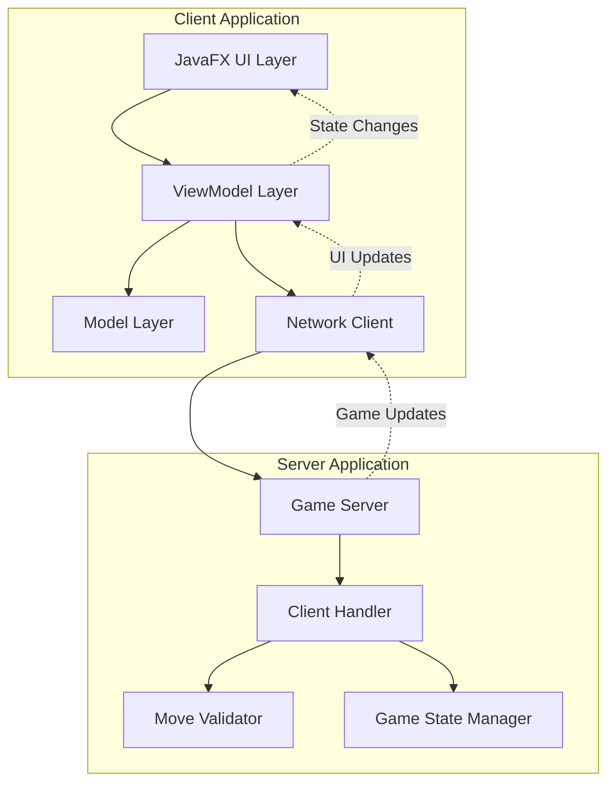
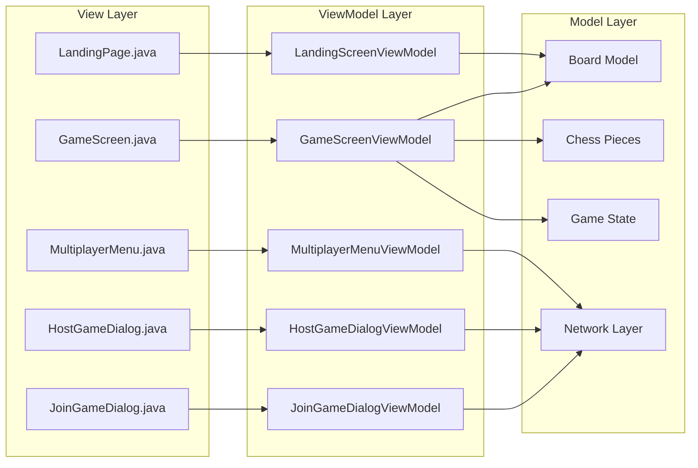
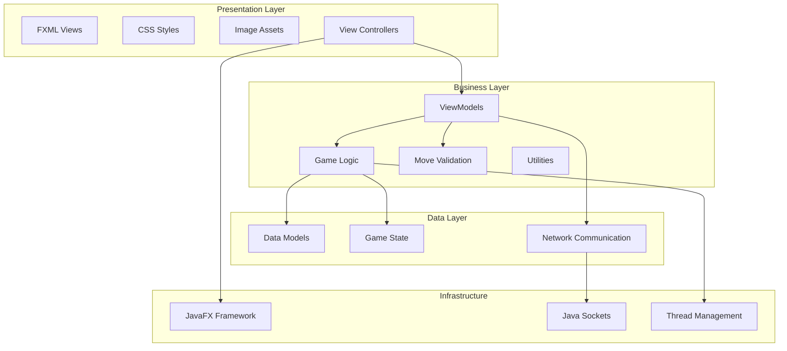
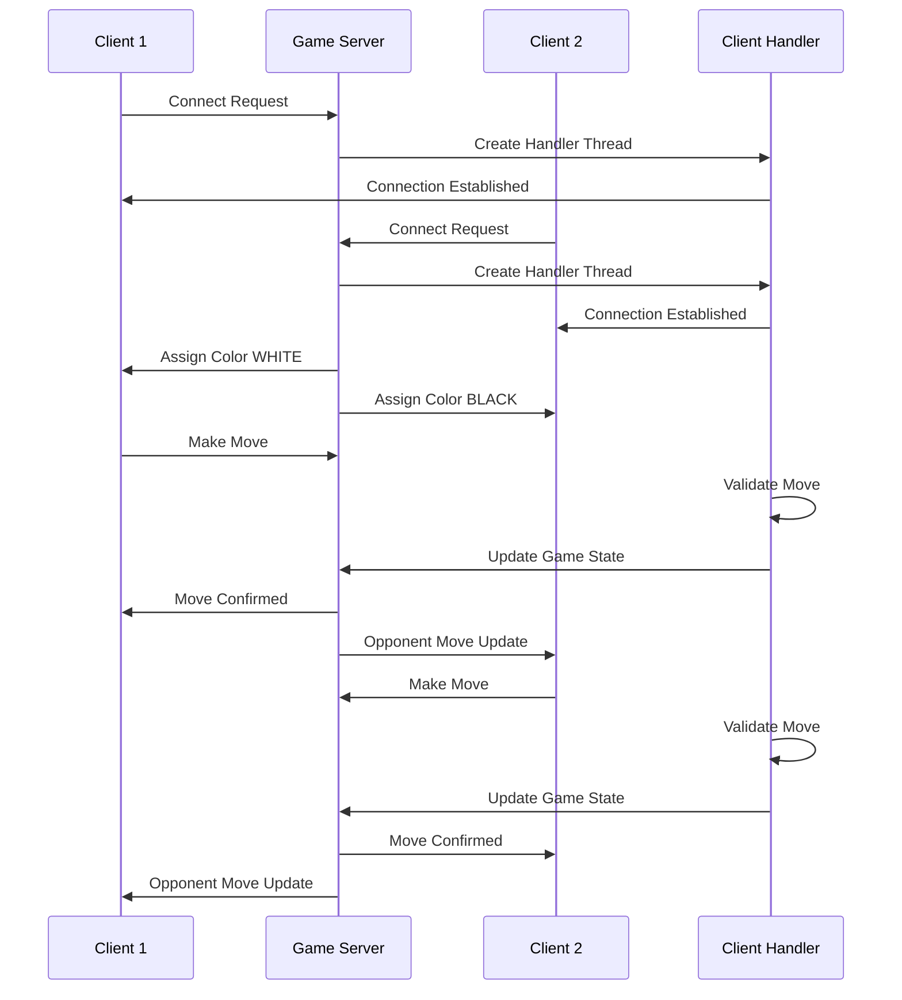
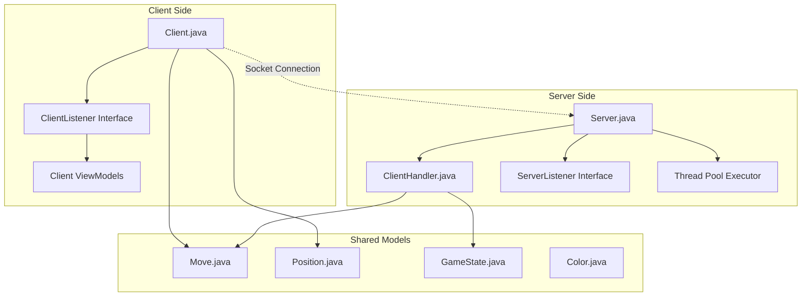
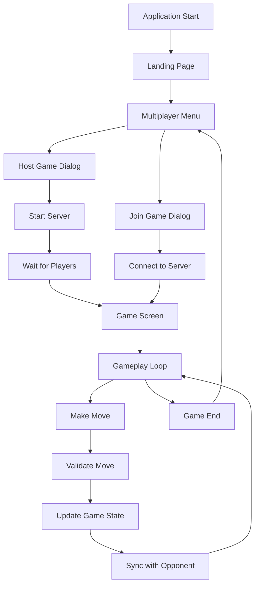
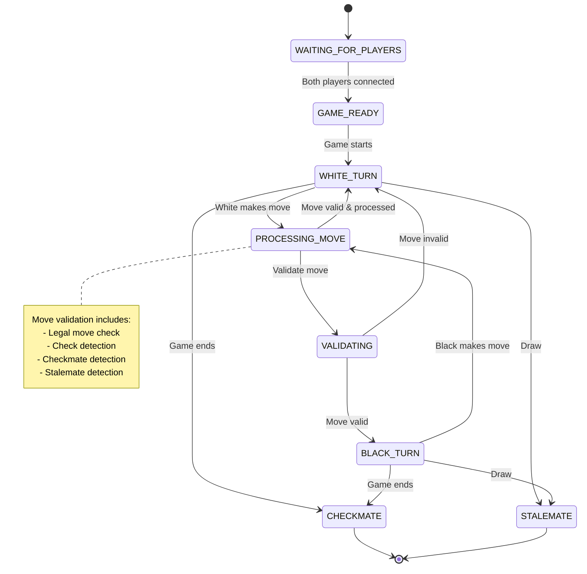
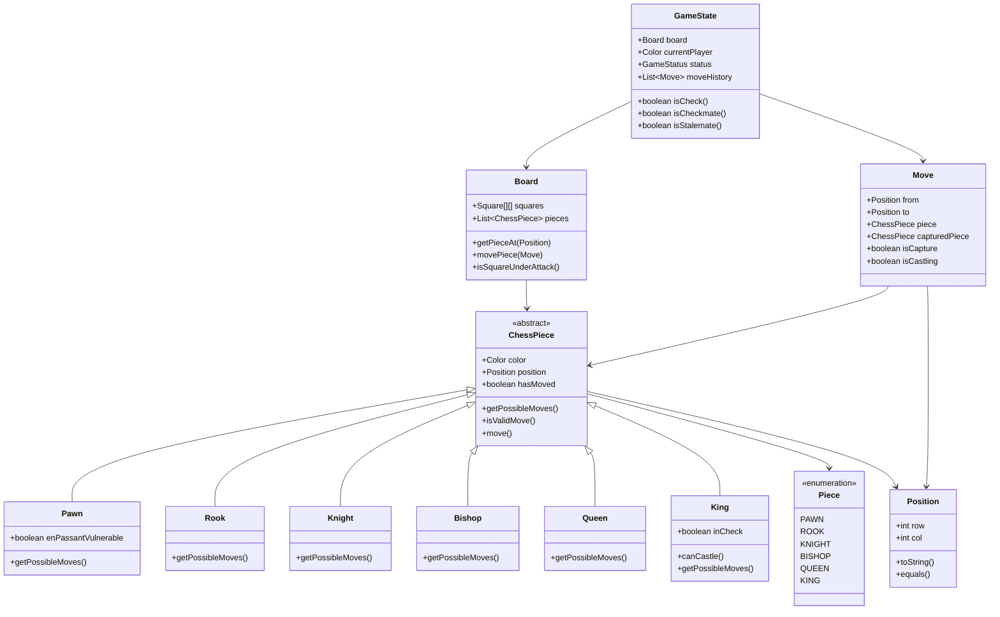
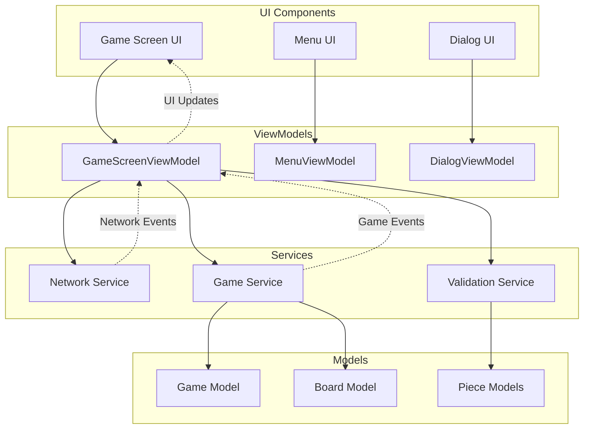
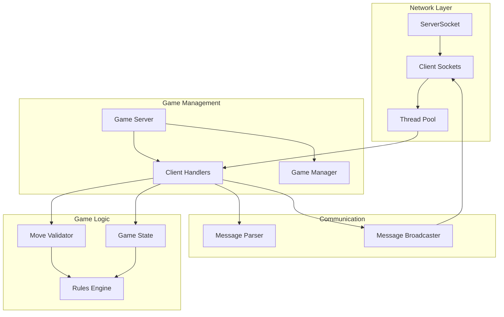

# Nexus Board - Game Architecture

This document provides a comprehensive overview of the Nexus Board chess application architecture, including system components, data flow, and interaction patterns.

## Table of Contents
- [System Overview](#system-overview)
- [Architecture Patterns](#architecture-patterns)
- [Application Layers](#application-layers)
- [Network Architecture](#network-architecture)
- [Game Flow](#game-flow)
- [Data Models](#data-models)
- [Component Interactions](#component-interactions)

## System Overview

Nexus Board is a multiplayer chess application built using JavaFX with a client-server architecture. The application follows MVVM (Model-View-ViewModel) pattern for clean separation of concerns.

## Architecture Patterns

### MVVM Pattern Implementation

## Application Layers

### Layer Structure

## Network Architecture

### Client-Server Communication

### Network Component Structure

## Game Flow

### Application Navigation Flow

### Game State Management

## Data Models

### Chess Model Hierarchy

## Component Interactions

### Client-Side Component Interaction

### Server-Side Component Interaction

## Technology Stack

- **Frontend**: JavaFX 22 with FXML and CSS
- **Backend**: Java 22 with Socket Programming
- **Architecture**: MVVM Pattern
- **Concurrency**: ExecutorService and Thread Pools
- **Build Tool**: Maven
- **Module System**: Java Platform Module System (JPMS)

## Key Design Decisions

1. **MVVM Pattern**: Ensures clear separation between UI and business logic
2. **Socket-based Networking**: Direct TCP communication for real-time gameplay
3. **Thread-per-Client**: Each client gets dedicated handler thread
4. **Centralized Game State**: Server maintains authoritative game state
5. **Event-driven Architecture**: UI updates through event listeners
6. **Modular Design**: Clear separation of chess logic, networking, and UI concerns

This architecture supports scalable multiplayer chess gameplay with clean code organization and maintainable design patterns.
