# Nexus Board Chess Game - Connection Diagram

## Game Component Connections and Data Flow

```mermaid
graph TB
    %% User Interface Layer
    subgraph "UI Layer - JavaFX"
        direction TB
        User[👤 User Input]
        LandingPage[🏠 LandingPage Controller]
        GameScreen[🎮 GameScreen Controller]
        
        subgraph "FXML Views"
            LandingFXML[Landing.fxml]
            GameFXML[Game.fxml]
        end
        
        subgraph "Visual Elements"
            ChessBoard[♟️ Chess Board Grid]
            PieceImages[🖼️ Piece Images]
            StatusPanels[📊 Status Panels]
            ControlButtons[🎛️ Control Buttons]
        end
    end

    %% ViewModel Layer (MVVM Bridge)
    subgraph "ViewModel Layer"
        LandingVM[🔗 LandingScreenViewModel]
        GameVM[🔗 GameScreenViewModel<br/>⚠️ Needs Implementation]
    end

    %% Core Game Logic
    subgraph "Game Engine"
        GameState[🎯 GameState<br/>Game Orchestrator]
        
        subgraph "Game Components"
            Board[🏁 Board<br/>8x8 Grid Manager]
            Move[🎲 Move<br/>Move Representation]
            Position[📍 Position<br/>Coordinate System]
            Square[⬜ Square<br/>Board Cell]
        end
        
        subgraph "Game Enums"
            Color[🎨 Color<br/>WHITE/BLACK]
            GameStatus[📈 GameStatus<br/>ACTIVE/CHECKMATE/etc]
        end
    end

    %% Chess Pieces Hierarchy
    subgraph "Chess Pieces"
        ChessPiece[♛ ChessPiece<br/>Abstract Base Class]
        
        subgraph "Piece Types"
            King[♔ King]
            Queen[♕ Queen]
            Rook[♖ Rook]
            Bishop[♗ Bishop]
            Knight[♘ Knight]
            Pawn[♙ Pawn]
        end
        
        Piece[🎭 Piece Interface]
    end

    %% Utility Systems
    subgraph "Utilities"
        FENUtils[📝 FENUtils<br/>Chess Notation]
        MoveValidator[✅ MoveValidator<br/>Move Validation]
    end

    %% Networking (Placeholder)
    subgraph "Network Layer"
        Server[🖥️ Server<br/>❌ Empty Stub]
        Client[💻 Client<br/>❌ Empty Stub]
        ClientHandler[🤝 ClientHandler<br/>❌ Missing]
    end

    %% Application Entry
    App[🚀 ChessApplication<br/>Main Entry Point]

    %% === MAIN GAME FLOW CONNECTIONS ===
    
    %% Application Start Flow
    App --> LandingPage
    User --> LandingPage
    LandingPage --> LandingVM
    LandingVM --> GameScreen
    
    %% UI to FXML Connections
    LandingPage -.->|loads| LandingFXML
    GameScreen -.->|loads| GameFXML
    
    %% UI Component Connections
    GameScreen --> ChessBoard
    GameScreen --> PieceImages
    GameScreen --> StatusPanels
    GameScreen --> ControlButtons
    
    %% ViewModel Connections (MVVM Pattern)
    GameScreen --> GameVM
    GameVM --> GameState
    
    %% === CORE GAME LOGIC CONNECTIONS ===
    
    %% Game State Management
    GameState --> Board
    GameState --> Move
    GameState --> Color
    GameState --> GameStatus
    
    %% Board System Connections
    Board --> Position
    Board --> Square
    Board --> ChessPiece
    
    %% Move System Connections
    Move --> Position
    Move --> ChessPiece
    
    %% Chess Piece Hierarchy
    ChessPiece --> Piece
    King --> ChessPiece
    Queen --> ChessPiece
    Rook --> ChessPiece
    Bishop --> ChessPiece
    Knight --> ChessPiece
    Pawn --> ChessPiece
    
    %% === UTILITY CONNECTIONS ===
    
    %% Validation and Utilities
    GameState --> MoveValidator
    GameState --> FENUtils
    Board --> FENUtils
    MoveValidator --> ChessPiece
    
    %% === RESOURCE CONNECTIONS ===
    
    %% Image Loading
    GameScreen -.->|loads| PieceImages
    PieceImages -.->|fallback| ChessPiece
    
    %% === PLANNED NETWORK CONNECTIONS ===
    
    %% Future Multiplayer Connections (Not Implemented)
    GameState -.->|future| Server
    GameState -.->|future| Client
    Server -.->|future| ClientHandler
    Client -.->|future| Server
    
    %% === USER INTERACTION FLOW ===
    
    %% User Input Flow
    User -->|click/drag| ChessBoard
    ChessBoard -->|square selection| GameScreen
    GameScreen -->|validate move| GameState
    GameState -->|execute move| Board
    Board -->|update pieces| ChessPiece
    ChessPiece -->|visual update| GameScreen
    
    %% Game State Updates
    GameState -->|status change| GameScreen
    GameScreen -->|UI update| StatusPanels
    
    %% Move History Flow
    GameState -->|add move| Move
    Move -->|display| GameScreen
    
    %% === STYLING AND VISUAL EFFECTS ===
    
    %% Styling Connections
    GameScreen -.->|styling| GameCSS[🎨 game.css]
    LandingPage -.->|styling| LandingCSS[🎨 landing.css]
    
    %% Visual Effects
    ChessBoard -.->|hover effects| GameCSS
    PieceImages -.->|animations| GameCSS
    
    %% === CONNECTION TYPES LEGEND ===
    
    %% Solid arrows: Active data flow/method calls
    %% Dotted arrows: Resource loading/styling
    %% Dashed arrows: Future/planned connections
    
    %% === STATUS COLOR CODING ===
    
    classDef implemented fill:#90EE90,stroke:#2E7D32,stroke-width:3px
    classDef partiallyImplemented fill:#FFE082,stroke:#F57C00,stroke-width:3px
    classDef notImplemented fill:#FFCDD2,stroke:#D32F2F,stroke-width:3px
    classDef resource fill:#E1BEE7,stroke:#8E24AA,stroke-width:2px
    classDef user fill:#BBDEFB,stroke:#1976D2,stroke-width:3px
    
    %% Apply Status Colors
    class GameState,Board,Position,Move,Square,Color,GameStatus implemented
    class ChessPiece,King,Queen,Rook,Bishop,Knight,Pawn,Piece implemented
    class LandingPage,GameScreen,App,FENUtils,MoveValidator implemented
    class LandingVM partiallyImplemented
    class GameVM,Server,Client,ClientHandler notImplemented
    class LandingFXML,GameFXML,PieceImages,GameCSS,LandingCSS resource
    class User user
```

## Connection Types Explanation

### 🔄 **Active Data Flow** (Solid Lines)
- **User Input → GameScreen → GameState**: Direct user interaction flow
- **GameState → Board → ChessPiece**: Game logic execution path
- **GameScreen ↔ GameState**: Real-time game state synchronization

### 📁 **Resource Loading** (Dotted Lines)
- **GameScreen → PieceImages**: Loading chess piece graphics
- **Controllers → FXML**: UI layout loading
- **UI → CSS**: Styling and visual effects

### 🔮 **Future Connections** (Dashed Lines)
- **GameState ↔ Network Components**: Planned multiplayer functionality
- **Client ↔ Server**: Future network communication

## Key Connection Points

### 🎯 **Central Hub: GameState**
The [`GameState`](GameState.java) class is the central orchestrator that connects:
- UI updates through GameScreen
- Move validation through MoveValidator
- Board state through Board class
- Game rules through chess pieces
- Utility functions (FEN, validation)

### 🎮 **UI Integration Point: GameScreen**
The [`GameScreen`](GameScreen.java) controller serves as the main UI hub:
- Displays visual chess board
- Handles user input (clicks, drags)
- Shows game status and information
- Loads and displays piece images
- Provides game controls

### ♟️ **Game Logic Flow**
1. **User clicks/drags** on chess board
2. **GameScreen captures** input and converts to positions
3. **GameState validates** move through MoveValidator
4. **Board executes** move by updating piece positions
5. **ChessPiece** updates its internal state
6. **GameScreen refreshes** visual display

## Implementation Status Summary

- ✅ **Complete**: Core game engine, chess pieces, basic UI
- 🟡 **Partial**: ViewModel layer, UI-logic integration  
- ❌ **Missing**: Networking, AI opponent, advanced features

This connection diagram shows that you have a well-architected chess game with clear separation of concerns and proper data flow patterns. The main work needed is connecting the UI to the game logic and implementing the networking layer for multiplayer functionality.