# Nexus Board Chess Application - Architecture Diagram

## Complete Project Architecture and Component Connections

```mermaid
graph TB
    %% Application Entry Point
    subgraph "Application Layer"
        App[ChessApplication]
        ModuleInfo[module-info.java]
    end

    %% Presentation Layer (View + ViewModel)
    subgraph "Presentation Layer (MVVM)"
        subgraph "View Controllers"
            Landing[LandingPage]
            GameScreen[GameScreen]
        end
        
        subgraph "ViewModels"
            LandingVM[LandingScreenViewModel]
            GameVM[GameScreenViewModel]
        end
        
        subgraph "FXML Resources"
            LandingFXML[Landing.fxml]
            GameFXML[Game.fxml]
        end
        
        subgraph "CSS Styles"
            LandingCSS[landing.css]
            GameCSS[game.css]
        end
    end

    %% Business Logic Layer
    subgraph "Model Layer (Game Logic)"
        subgraph "Core Game Management"
            GameState[GameState]
            GameStatus[GameStatus enum]
            Color[Color enum]
        end
        
        subgraph "Board System"
            Board[Board]
            Square[Square]
            Position[Position]
            Move[Move]
        end
        
        subgraph "Chess Pieces Hierarchy"
            ChessPiece[ChessPiece<br/>Abstract Base]
            King[King]
            Queen[Queen]
            Rook[Rook]
            Bishop[Bishop]
            Knight[Knight]
            Pawn[Pawn]
            Piece[Piece interface]
        end
    end

    %% Utility Layer
    subgraph "Utility Layer"
        FENUtils[FENUtils]
        MoveValidator[MoveValidator]
    end

    %% Networking Layer (Skeleton)
    subgraph "Network Layer (Not Implemented)"
        Server[Server<br/>Empty Stub]
        Client[Client<br/>Empty Stub]
        ClientHandler[ClientHandler<br/>Missing]
    end

    %% Resources
    subgraph "Static Resources"
        subgraph "Chess Piece Images"
            WhiteImages[White Pieces<br/>6 PNG files]
            BlackImages[Black Pieces<br/>6 PNG files]
        end
    end

    %% Build Configuration
    subgraph "Build & Configuration"
        POM[pom.xml<br/>Maven Config]
        README[README.md]
    end

    %% Main Connections - Application Flow
    App --> Landing
    Landing --> LandingVM
    LandingVM --> GameScreen
    
    %% FXML and CSS Connections
    Landing -.-> LandingFXML
    Landing -.-> LandingCSS
    GameScreen -.-> GameFXML
    GameScreen -.-> GameCSS
    
    %% Game Logic Connections
    GameScreen --> GameState
    LandingVM --> GameState
    
    %% Board System Connections
    GameState --> Board
    GameState --> Move
    GameState --> Color
    GameState --> GameStatus
    
    Board --> Position
    Board --> Square
    Board --> ChessPiece
    
    Move --> Position
    Move --> ChessPiece
    
    %% Chess Pieces Hierarchy
    ChessPiece --> Piece
    King --> ChessPiece
    Queen --> ChessPiece
    Rook --> ChessPiece
    Bishop --> ChessPiece
    Knight --> ChessPiece
    Pawn --> ChessPiece
    
    %% Utility Connections
    GameState --> MoveValidator
    GameState --> FENUtils
    Board --> FENUtils
    
    %% Resource Connections
    GameScreen -.-> WhiteImages
    GameScreen -.-> BlackImages
    
    %% Network Connections (Planned)
    GameState -.-> Server
    GameState -.-> Client
    Server -.-> ClientHandler
    
    %% Configuration
    App -.-> POM
    ModuleInfo -.-> POM

   %% Styling for Implementation Status with Muted and Cool Colors and Black Text
    classDef implemented fill:#B0C4DE,stroke:#333333,stroke-width:2px,color:#000000
    classDef partiallyImplemented fill:#D3D3D3,stroke:#333333,stroke-width:2px,color:#000000
    classDef notImplemented fill:#C0C0C0,stroke:#333333,stroke-width:2px,color:#000000
    classDef resource fill:#E6E6FA,stroke:#333333,stroke-width:2px,color:#000000
    classDef config fill:#F5F6F5,stroke:#333333,stroke-width:2px,color:#000000
    
    %% Apply styles
    class App,Landing,GameScreen,LandingVM,GameState,Board,Position,Move,Square implemented
    class King,Queen,Rook,Bishop,Knight,Pawn,ChessPiece,Piece,Color,GameStatus implemented
    class FENUtils,MoveValidator implemented
    class GameVM partiallyImplemented
    class Server,Client,ClientHandler notImplemented
    class LandingFXML,GameFXML,LandingCSS,GameCSS,WhiteImages,BlackImages resource
    class POM,README,ModuleInfo config
```



## Implementation Status Legend

- 🟢 **Green (Implemented)**: Fully functional components with complete implementation
- 🟡 **Orange (Partial)**: Components with basic structure but incomplete functionality  
- 🔴 **Pink (Not Implemented)**: Skeleton classes or missing components
- 🟣 **Purple (Resources)**: Static files, FXML layouts, CSS, images
- 🔵 **Blue (Configuration)**: Build files, documentation, module configuration

## Key Architectural Patterns

1. **MVVM Pattern**: Clear separation between View (Controllers), ViewModel, and Model
2. **Layered Architecture**: Presentation → Business Logic → Utility → Network
3. **Component Hierarchy**: Chess pieces follow inheritance pattern with abstract base class
4. **Resource Management**: Centralized image loading with fallback to Unicode symbols

## Critical Connections

### Data Flow
1. **User Input**: GameScreen → GameState → Board → ChessPiece
2. **Game Logic**: GameState orchestrates all game rules and state management
3. **Move Validation**: GameState → MoveValidator → ChessPiece movement rules
4. **UI Updates**: GameState changes → GameScreen updates → Visual feedback

### Dependencies
- **GameScreen** depends on **GameState** for all game logic
- **GameState** depends on **Board** for piece management
- **Board** depends on **ChessPiece** hierarchy for piece behavior
- **All components** use **Position** for coordinate system

## Future Implementation Priorities

1. **Connect UI to Game Logic**: Complete GameScreen ↔ GameState integration
2. **Implement Networking**: Complete Server, Client, ClientHandler classes
3. **Add AI Opponent**: Implement computer player for single-player mode
4. **Complete ViewModels**: Implement missing GameScreenViewModel
```